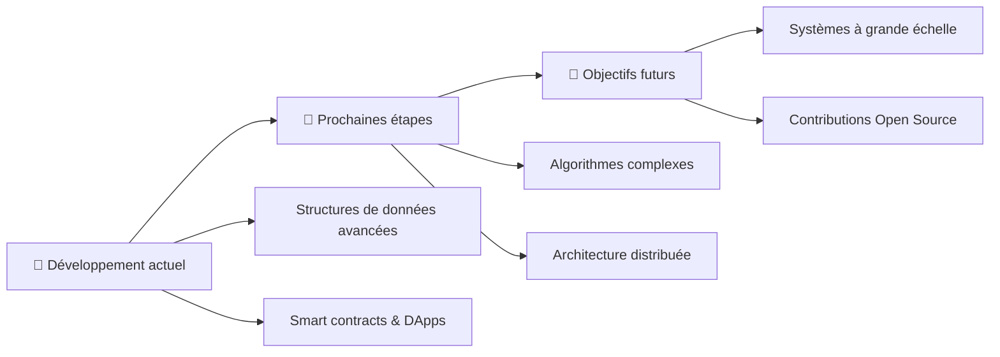

<div align="center">

# 👋 Salut, moi c'est Ayoub

### 🛡️ Passionné par la cybersécurité, le développement et l'apprentissage continu

[](https://github.com/ayoubkad)
[](https://github.com/ayoubkad?tab=followers)
[](https://github.com/ayoubkad)

</div>

---

## 🧑‍💻 À propos

<table>
<tr>
<td>

🎯 **Développeur & Étudiant**  
Spécialisé en développement d'applications décentralisées et systèmes bas niveau

💻 **Technologies**  
JavaScript, C, HTML - Blockchain & Web3

</td>
<td>

📚 **Projets actifs**  
Applications décentralisées, bases de données optimisées

🚀 **Compétences**  
Structures de données • Gestion mémoire • Smart contracts

</td>
</tr>
</table>

## 💡 Domaines d'expertise

<details open>
<summary><b>🔗 Blockchain & Applications Décentralisées</b></summary>

```javascript
• Smart contracts development
• Web3 integration
• Decentralized applications (DApps)
• Vercel deployment & CI/CD
```
</details>

<details open>
<summary><b>⚡ Programmation Système & Performance</b></summary>

```c
• Gestion mémoire dynamique (Linked Lists)
• Fichiers binaires & persistance
• Structures de données optimisées
• Algorithmes haute performance
```
</details>

<details open>
<summary><b>🌐 Développement Web & Frontend</b></summary>

```javascript
• JavaScript / Node.js
• HTML5 & interfaces modernes
• Git & collaboration
• Déploiement continu
```
</details>

### 📊 Statistiques Réelles

<p align="center">
  
  
  
</p>

## 🧰 Stack Technique

### 💻 Langages & Développement
<p>
  
  
  
  
  
</p>

### 🔗 Technologies Blockchain & Web3
<p>
  
  
  
</p>

### 🛠️ Outils & Environnement
<p>
  
  
  
  
</p>

## 🚀 Projets Réels

<table>
<tr>
<td width="50%">

### 🔗 [ApplicationeDcentraliser](https://github.com/ayoubkad/ApplicationeDcentraliser)
[](https://github.com/ayoubkad/ApplicationeDcentraliser)

```javascript
Application décentralisée pour
la gestion de bibliothèques
universitaires
```
**Tech:** JavaScript, Web3, Blockchain  
**Status:** ⭐ 8 stars • 🚀 [Live Demo](https://applicatione-dcentraliser-3rjknrr0n-ayoubkads-projects.vercel.app/)

</td>
<td width="50%">

### 💾 [Mini-Database](https://github.com/ayoubkad/Mini-Database)
[](https://github.com/ayoubkad/Mini-Database)

```c
Système de gestion d'étudiants
haute performance en C avec
listes chaînées & fichiers binaires
```
**Tech:** C, Linked Lists, Binary Files  
**Status:** ⭐ 2 stars • 🏗️ Récemment mis à jour

</td>
</tr>
<tr>
<td width="50%">

### 📚 [skills-introduction-to-github](https://github.com/ayoubkad/skills-introduction-to-github)

```html
Exercice d'introduction à GitHub
Apprentissage des workflows
et bonnes pratiques Git
```
**Tech:** HTML, Git, GitHub Actions  
**Status:** ✅ Complété

</td>
<td width="50%">

### 👤 [ayoubkad](https://github.com/ayoubkad/ayoubkad)

```markdown
Repository de profil GitHub
Documentation & présentation
Portfolio personnel
```
**Tech:** Markdown, GitHub Profile  
**Status:** 📝 En cours de mise à jour

</td>
</tr>
</table>

## 📚 Apprentissage & Évolution



**Compétences en développement:**
- ✅ Gestion mémoire dynamique en C (listes chaînées, fichiers binaires)
- ✅ Applications décentralisées avec Web3 et blockchain
- 🔄 Optimisation de performances et structures de données

**Prochaines étapes:**
- 📋 Approfondir les algorithmes de cryptographie
- 📋 Développer des smart contracts plus complexes
- 📋 Contribuer à des projets open source blockchain

**Objectifs long terme:**
- 🎓 Expertise en systèmes distribués
- 🏆 Développement de DApps à grande échelle

## 📈 Statistiques GitHub

<div align="center">


</div>

## 📬 Contact & Réseaux

<div align="center">

[](mailto:votre.email@example.com)
[](https://linkedin.com/in/votre-profil)
[](https://twitter.com/votre-compte)
[](https://discord.com)

🔐 **PGP Fingerprint:** `XXXX XXXX XXXX XXXX XXXX XXXX XXXX XXXX` *(optionnel)*

</div>

---

<div align="center">

### 💭 Citation

*"La sécurité n'est pas un produit, mais un processus."*  
— Bruce Schneier

---


</div>
